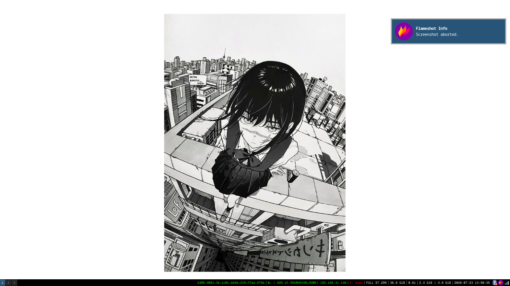
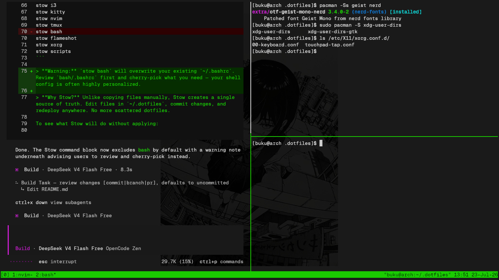
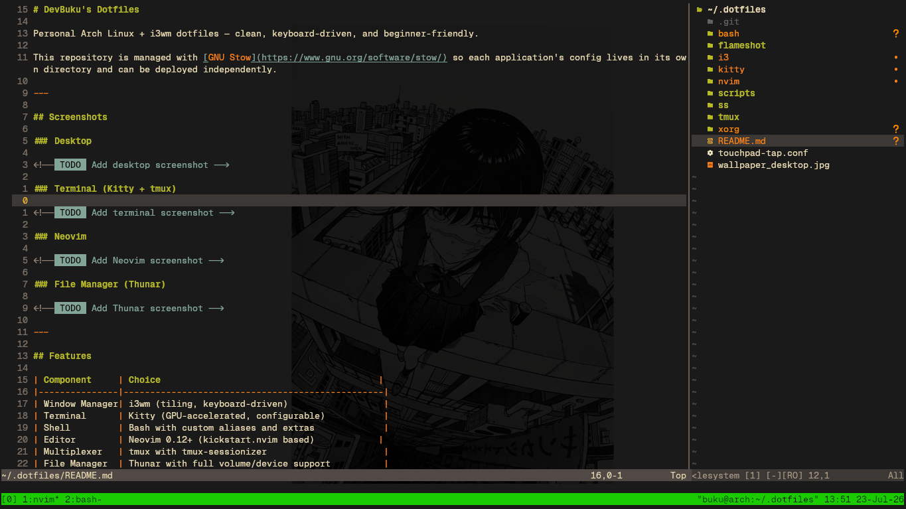

Arch Linux + i3wm dotfiles managed with [GNU Stow](https://www.gnu.org/software/stow/).

## Screenshots

| Desktop | Terminal | Neovim |
|---------|----------|--------|
|  |  |  |

## Features

| Component     | Choice                              |
|---------------|-------------------------------------|
| WM            | i3wm                                |
| Terminal      | Kitty                               |
| Shell         | Bash                                |
| Editor        | Neovim 0.12+ (kickstart.nvim)       |
| Multiplexer   | tmux + tmux-sessionizer             |
| File Manager  | Thunar                              |
| Launcher      | dmenu                               |
| Screenshots   | Flameshot                           |
| Dotfile Mgmt  | GNU Stow                            |
| Font          | GeistMono Nerd Font                 |

## Installation

```bash
git clone https://github.com/devbuku/.dotfiles.git ~/.dotfiles
cd ~/.dotfiles

stow i3 kitty nvim tmux flameshot xorg scripts
```

> **Warning:** `stow bash` will overwrite `~/.bashrc`. Review it first.

## Required Packages

```
stow i3-wm kitty neovim tmux thunar thunar-volman tumbler
gvfs gvfs-mtp gvfs-afc gvfs-gphoto2 gvfs-smb gvfs-nfs
udisks2 polkit polkit-gnome dmenu flameshot brightnessctl
i3status xclip fzf ripgrep tree-sitter-cli python-virtualenv
python-pip base-devel xdg-user-dirs xcompmgr xwallpaper
network-manager-applet blueman
```

Node.js via [nvm](https://github.com/nvm-sh/nvm).

## Font

```bash
sudo pacman -S otf-geist-mono-nerd
```

Nerd Font required for icons in Neovim, tmux, and Thunar.

## Laptop Users

```bash
sudo cp touchpad-tap.conf /etc/X11/xorg.conf.d/
```

Enables tap-to-click.

## Components

- **Bash** — aliases, PATH, nvm, tmux-sessionizer (Ctrl-f)
- **tmux** — prefix Ctrl-b, sessionizer on `f`, Alt+number for windows, Alt+hjkl for panes
- **Neovim** — kickstart.nvim, neo-tree, copilot, autopairs, git, gruvbox. Requires tree-sitter, Node.js (nvm), python-virtualenv
- **Thunar** — USB, Android, iPhone, network shares via gvfs + udisks2. Enable: `sudo systemctl enable --now udisks2`
- **i3** — starts via `xorg/.xinitrc`: xcompmgr, xwallpaper, polkit-gnome, Caps→Escape remap, exec i3

## Post-Install

```bash
xdg-user-dirs-update
sudo systemctl enable --now udisks2
```

## Repository

| Directory       | Contents                               |
|-----------------|----------------------------------------|
| `i3/`           | i3 config                              |
| `kitty/`        | Kitty config                           |
| `nvim/`         | Neovim config                          |
| `tmux/`         | tmux config                            |
| `bash/`         | .bashrc                                |
| `xorg/`         | .xinitrc                               |
| `scripts/`      | tmux-sessionizer                       |
| `flameshot/`    | Flameshot config                       |
| `touchpad-tap.conf` | Xorg touchpad config (manual copy) |

## Credits

[i3wm](https://i3wm.org/) · [Neovim](https://neovim.io/) · [GNU Stow](https://www.gnu.org/software/stow/) · [tmux](https://github.com/tmux/tmux) · [Kitty](https://sw.kovidgoyal.net/kitty/) · [Thunar](https://docs.xfce.org/xfce/thunar/start) · [Arch Linux](https://archlinux.org/)